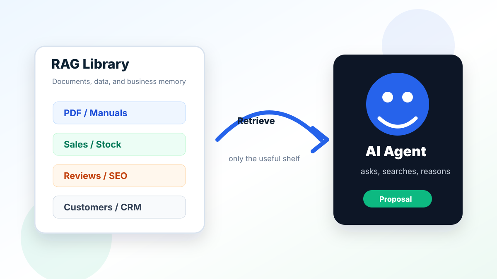
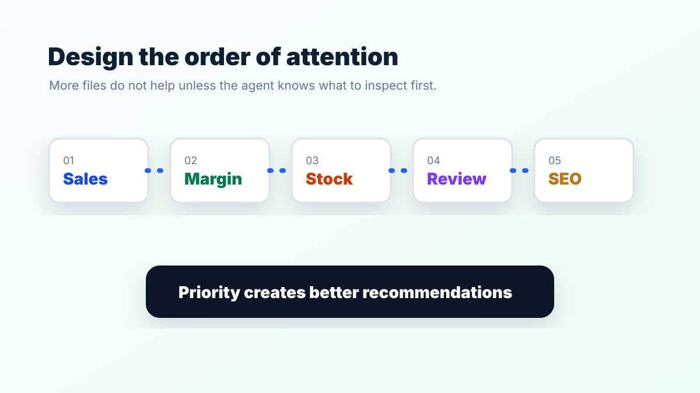
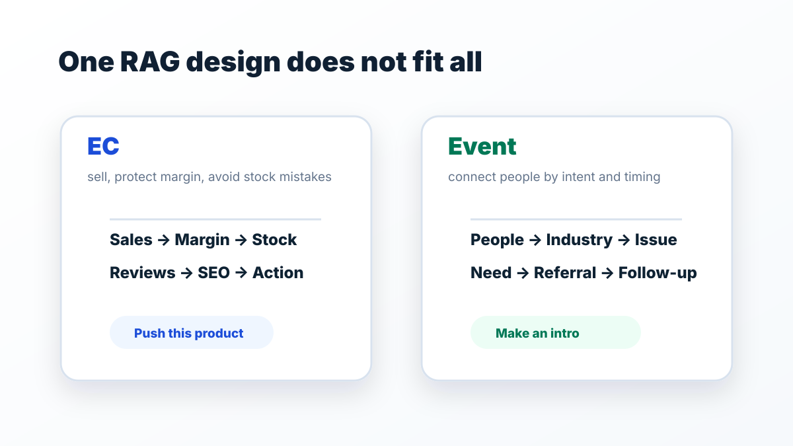
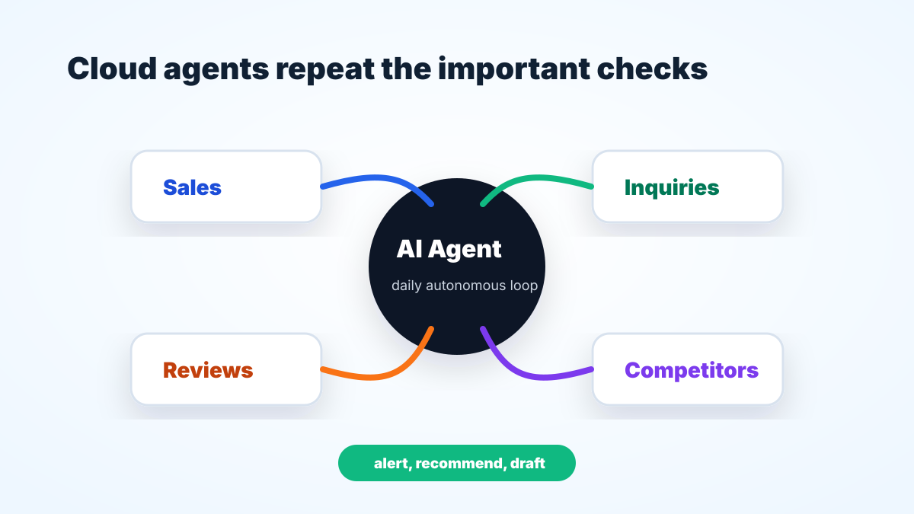
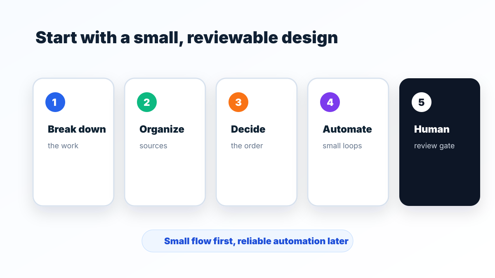
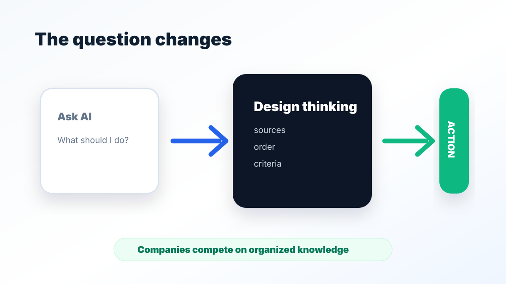

<strong>RAGは、AIが仕事に必要な資料を探せるようにする仕組みです。</strong>

難しいシステムから考える必要はありません。最初に決めるのは「何を見せるか」「どの順番で見るか」「最後に人が何を確認するか」の3つです。

## この資料でわかること

- RAGという言葉を、仕事の言葉で説明できる
- AIに渡す資料と、見る順番を決められる
- ネットショップ（EC）、問い合わせ、交流会など、業務ごとに順番を変えられる
- AIに任せる部分と、人が確認する部分を分けられる
- 自分の仕事で小さなRAG設計を書き始められる

<b>対象:</b> ChatGPTは使っているものの、自社資料、顧客情報、売上データ、商品情報、問い合わせ履歴をどう活用すればよいか迷っている事業者向けです。

## まず結論

<blockquote class="rag-quote">RAGは「AI専用の資料棚」です。良いRAG設計は、資料の量ではなく、AIが見る順番と人の確認場所まで決まっています。</blockquote>

<h3>AIに任せる</h3>
資料を探す、数字の変化を見つける、原因候補や下書きを出す。

<h3>人が決める</h3>
価格変更、広告出稿、顧客への連絡、文章の公開など、影響が大きい判断を確認する。

## 順番に理解する本文

### 1. RAGは、AIが資料を探してから答える仕組み

RAGは「Retrieval-Augmented Generation」の略です。日本語では、AIが外部の資料を検索し、その内容を使って回答する仕組み、と考えれば十分です。

たとえば、次の資料をAIが探せるようにします。

- 商品情報、在庫、売上表
- マニュアル、議事録、過去の対応記録
- 顧客の相談内容、よくある質問
- 過去の記事、レビュー、イベント記録

資料をただ集めるだけでは足りません。古い資料や関係のない資料まで混ざると、AIも迷います。

### 2. 先に「見る順番」を決める

<figure class="rag-visual">

<figcaption>同じ資料でも、先に見るものが違えば、提案も変わります。</figcaption>
</figure>

「売上が落ちた理由を調べる」なら、いきなり販促案を作らせません。まず数字と現場の状態を確認します。

売上を見る
↓
利益率を見る
↓
在庫を見る
↓
レビューを見る
↓
競合を見る
↓
改善案を出す

この順番が決まっていると、AIは雰囲気ではなく、確認した情報をもとに提案できます。

### 3. 業務が変われば、見る順番も変える

<figure class="rag-visual">

<figcaption>正解は1つではありません。実際の仕事の流れに合わせます。</figcaption>
</figure>

SEOは検索結果で見つけてもらう工夫、FAQはよくある質問、内部リンクは同じWebサイト内の関連記事へ案内するリンクです。

<table class="rag-table">
<thead><tr><th>業務</th><th>AIが見る順番</th><th>最後に出すもの</th></tr></thead>
<tbody>
<tr><td>ネットショップ（EC）</td><td>売上 → 利益率 → 在庫 → レビュー → SEO</td><td>推す商品、直す商品ページ、止める広告</td></tr>
<tr><td>問い合わせ</td><td>相談内容 → 顧客区分 → 過去対応 → FAQ</td><td>返信案、確認事項、担当者への引き継ぎ</td></tr>
<tr><td>交流会</td><td>参加者 → 業種 → 悩み → 紹介先 → 次回連絡</td><td>紹介候補、会話テーマ、フォロー予定</td></tr>
<tr><td>ブログ</td><td>検索語 → 顧客の悩み → 商品 → 過去記事 → 競合</td><td>記事テーマ、見出し、内部リンク</td></tr>
</tbody>
</table>

### 4. 毎日の確認をAIに任せる

<figure class="rag-visual">

<figcaption>AIエージェントは、決めた順番で同じ確認を続ける時に力を発揮します。</figcaption>
</figure>

AIエージェントとは、指示された仕事を複数の手順に分けて進めるAIです。毎朝、売上、問い合わせ、レビュー、在庫を確認させることもできます。

良い報告は「問題があります」で終わりません。

<h3>在庫</h3>
この商品は売れていますが、在庫が少ないため、広告を増やす前に仕入れ確認が必要です。

<h3>販促</h3>
利益率とレビューが良いため、今週はこの商品を優先して紹介できます。

<h3>記事</h3>
検索されている言葉と問い合わせ内容が重なるため、このテーマの記事が有効です。

<h3>顧客対応</h3>
前回の相談が未解決です。今日中に人が内容を確認し、連絡してください。

### 5. 重要な判断は人が確認する

<figure class="rag-visual">

<figcaption>AIが下調べと下書きを担当し、影響が大きい判断は人が確認します。</figcaption>
</figure>

AIにすべてを決めさせる必要はありません。次の作業は、人の確認を残します。

- 価格、契約、支払いに関わる変更
- 広告の出稿や予算変更
- 顧客への連絡、個人情報の利用
- Web、SNS、メールなど外部への公開

## 具体例 / やってみる

### 5つの項目を1枚に書く

<table class="rag-table">
<thead><tr><th>項目</th><th>ECの記入例</th></tr></thead>
<tbody>
<tr><td>1. 調べる仕事</td><td>売上低下の原因を確認する</td></tr>
<tr><td>2. 使う資料</td><td>売上表、利益率、在庫、レビュー、競合、過去施策</td></tr>
<tr><td>3. 見る順番</td><td>売上 → 利益率 → 在庫 → レビュー → 競合</td></tr>
<tr><td>4. AIに任せる</td><td>毎朝の確認、異常の通知、改善案の下書き</td></tr>
<tr><td>5. 人が確認する</td><td>価格変更、広告出稿、顧客連絡、公開文章</td></tr>
</tbody>
</table>

### そのまま使える依頼文

あなたはEC運営の分析担当です。

毎朝、売上、利益率、在庫、レビュー、競合の順に確認してください。
異常があれば、次の3つを出してください。
1. 原因の候補
2. 人が確認する画面や数字
3. 今日できる改善案

価格変更、広告出稿、顧客連絡、文章公開は自動で実行せず、「人の確認が必要」と分けてください。

最初は1つの業務だけで試します。資料の不足や順番の間違いが見つかったら、焦らず直します。

## 振り返り / 次の一歩

<figure class="rag-visual">

<figcaption>質問の工夫だけでなく、資料、順番、確認方法を整えることが次の一歩です。</figcaption>
</figure>

<ul class="rag-check">
<li>AIに任せたい仕事を1つに絞った</li>
<li>使う資料を5種類以内で選んだ</li>
<li>AIが見る順番を矢印で書いた</li>
<li>AIが出す報告の形を決めた</li>
<li>人が確認する判断を決めた</li>
<li>まず1週間試し、結果を見直す</li>
</ul>

<h3>自分の仕事で、最初のRAG設計を作る</h3>

難しいシステムを入れる前に、対象業務、使う資料、見る順番、人が確認する場所を一緒に整理します。

<a href="/#contact">無料でAI活用を相談する</a>
<a href="/#packages">受講プランを見る</a>
<a href="/#lectures">受講資料を見る</a>

### 参考リンク

<ul>
<li><a href="https://aws.amazon.com/what-is/retrieval-augmented-generation/" target="_blank" rel="noopener">AWS: What is RAG?</a></li>
<li><a href="https://cloud.google.com/use-cases/retrieval-augmented-generation" target="_blank" rel="noopener">Google Cloud: Retrieval-Augmented Generation</a></li>
<li><a href="https://learn.microsoft.com/en-us/azure/search/retrieval-augmented-generation-overview" target="_blank" rel="noopener">Microsoft Learn: RAG overview</a></li>
<li><a href="https://www.ibm.com/think/topics/retrieval-augmented-generation" target="_blank" rel="noopener">IBM Think: What is RAG?</a></li>
</ul>

