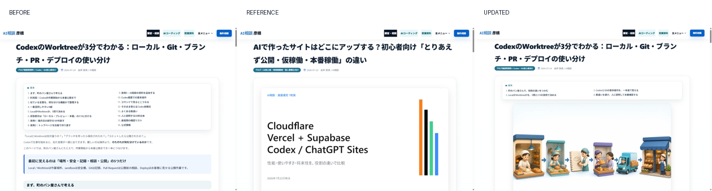
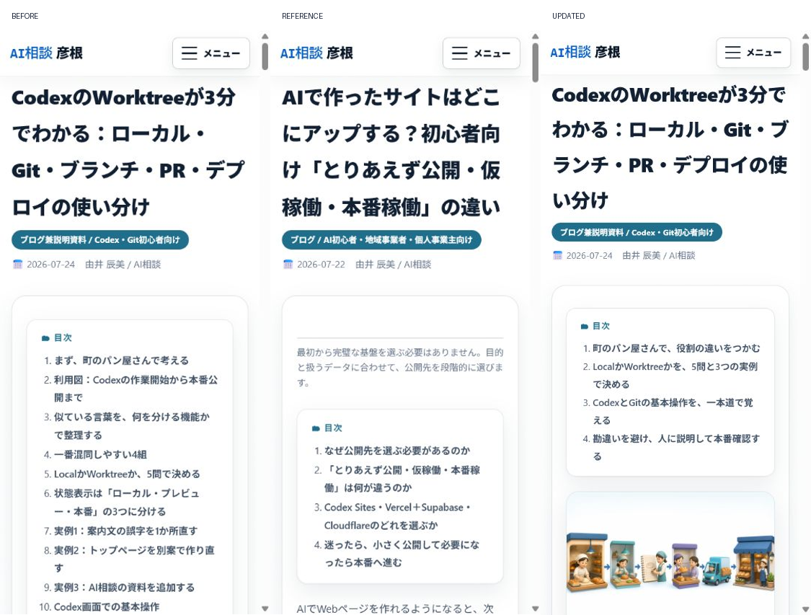

# Codex Worktree記事 デザイン一貫性監査

実施日: 2026-07-24

## 監査範囲

- 対象: `/blog/2026-07-24-codex-worktree-git-deploy-guide.html`
- 比較: 直近ブログ `/blog/2026-07-22-ai-site-publishing-stages.html`
- 比較: 受講資料 `/lectures/2026-07-ai-online-salon-practice.html`
- 画面幅: PC 1440px、スマホ 390px

## 読者の目的

Git初心者が、Local、Worktree、Sandbox、Branch、Commit、Pull Request、Deployの役割を混同せず、今どの段階にいるか説明できること。

## 比較画像

## 監査結果

### 1. 記事上部 — 改善済み

- 共通ヘッダー、本文幅、タイトル、メタ情報は既存ブログ・受講資料と一致していた。
- 修正前は画像が0枚で、既存記事にある教材らしい視覚的な入口がなかった。
- 表紙画像を追加し、ブログ一覧カードにも同じ画像を表示した。

### 2. 目次と情報構造 — 改善済み

- 修正前はH2が16個あり、スマホでは目次だけで最初の画面を大きく占有していた。
- 既存ブログの標準に合わせ、内容を削らず4章へ再編した。
- 細かな話題はH3・H4へ下げ、目次を4項目に短縮した。

### 3. 章ごとの理解補助 — 改善済み

- 4つのH2すべての直下に、その章専用の図解を配置した。
- 画像は白背景、ネイビー、青、青緑、少量のオレンジと紫に統一した。
- 表紙1枚、章画像4枚の合計5枚。すべて3:2で、PCとスマホで同じ比率を保つ。

### 4. レスポンシブ表示 — 良好

- PC: 横方向の本文崩れなし。画像、目次、タイトルの階層を確認。
- スマホ: ページ全体の横スクロールなし。4項目の目次後に表紙が見える。
- モバイルメニューボタンの表示を確認。

## アクセシビリティ上の確認

- 5枚すべてに内容を説明する代替テキストを設定した。
- 各図に短いキャプションを付け、画像だけに意味を依存させていない。
- 見出し階層をH2 → H3 → H4の順に整理した。
- スクリーンショットではキーボード操作や読み上げ順の完全確認まではできないため、完全なWCAG適合を示す監査ではない。

## 検証値

- H2: `16 → 4`
- 記事内画像: `0 → 5`
- H2直下の専用図解: `0 / 16 → 4 / 4`
- PC・スマホのブラウザエラー: `0`
- ブログ一覧の表紙画像: 読み込み成功

